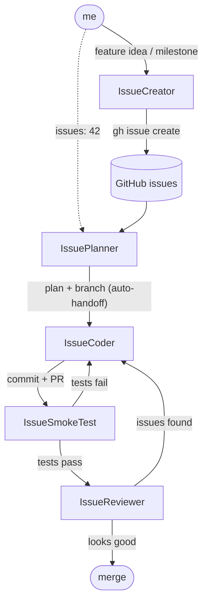
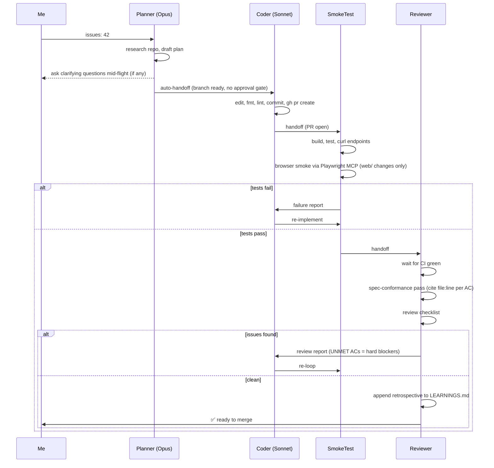

# bastion

A vibe-coded tower-defense project. The code in here was not lovingly hand-crafted — it was orchestrated through a small army of AI agents that plan, code, smoke test, and review each other in a loop. I sit at the wheel; the agents do the typing.

This README is mostly about **how I work on this repo**, not about the game.

## The agent pipeline

Four agents in a chain, plus a creator for backlog grooming:

**Planner → Coder → SmokeTest → Reviewer**

There are three parallel sets of agent definitions — same pipeline, different homes:

- **VS Code (Copilot Chat)** reads [`.github/agents/*.agent.md`](./.github/agents/)
- **Cursor** reads [`.cursor/agents/*.md`](./.cursor/agents/) plus rules in [`.cursor/rules/*.mdc`](./.cursor/rules/)
- **Claude Code** reads [`.claude/agents/*.md`](./.claude/agents/) and the orchestrator at [`.claude/commands/pipeline.md`](./.claude/commands/pipeline.md)

Keeping them in sync is a manual chore, but the workflow they describe is identical.



The handoffs are wired in the agent frontmatter (`handoffs:` block), so once a stage finishes the next one is auto-invoked. Reviewer and Planner are read-only — only the Coder writes files.

## Example flow — VS Code (Copilot Chat)

This is my daily driver. Copilot Chat picks up the agents from `.github/agents/*.agent.md` automatically.

1. **Groom the backlog** — `@IssueCreator break down the lobby-matchmaking feature into issues`. It runs an ambiguity gate (lists every unclear point or writes NONE), waits for answers, then writes labels, milestones, and issues with binary acceptance criteria via `gh`. **This is the real planning gate** — the AC list is the contract everything downstream is measured against.
2. **Plan** — `@IssuePlanner issues: 42`. Reads the issue, scans `LEARNINGS.md` for past lessons that apply, greps the repo, asks clarifying questions mid-flight if anything's ambiguous, writes a plan to `/memories/session/plan.md`, creates the branch, and auto-hands off to the Coder. There is no terminal "approve plan" gate by design — if you need one, you wanted the ambiguity caught at issue-creation time.
3. **Auto-handoff to Coder** — implements the plan (tests-first for any pure-domain code under `internal/<subsystem>/`), runs `make fmt` / `make lint` / `bun run lint`, commits, opens a PR.
4. **Auto-handoff to SmokeTest** — builds, runs unit tests, boots the server, curls the new endpoints. For any change under `web/`, also drives a real browser via the [Playwright MCP](https://github.com/microsoft/playwright-mcp) server (registered in `.mcp.json`, `.cursor/mcp.json`, `.vscode/mcp.json`) to navigate, snapshot, screenshot canvas pages, and check console errors. **Browser smoke is local-only** — CI does curl + unit; the MCP layer is what the local pipeline catches on top.
5. **Auto-handoff to Reviewer** — waits for CI green, does an explicit spec-conformance pass (cites a `file:line` for every acceptance-criterion checkbox or marks it UNMET), runs the review checklist, and appends a one-line **Retrospective** to `LEARNINGS.md` so each PR compounds into project memory. Bounces back to Coder on findings; otherwise I merge.

Models used (set per-agent in the frontmatter):
- Planner: **Claude Opus 4.7**
- Coder / SmokeTest / Reviewer: **Claude Sonnet 4.6**

## Example flow — Cursor

Cursor has its own agent system under [`.cursor/agents/`](./.cursor/agents/) (`planner.md`, `coder.md`, `smoke-tester.md`, `reviewer.md`, `issue-creator.md`) with shared conventions in `_bastion-conventions.md` and rules in `.cursor/rules/subagents.mdc`. The pipeline mirrors the VS Code one one-for-one:

```
@planner issues: 42   →   @coder   →   @smoke-tester   →   @reviewer
```

No terminal plan-approval gate — clarifications happen mid-flight via `askQuestions`, and the real planning happens upstream in `@issue-creator`.

**A note on models:** you should be running better models than I did here — ideally **Opus 4.7** (or whatever the current top-tier reasoner is) on the planner, and Sonnet 4.6 on the rest. Planning is where bad calls compound, so spend the tokens there. I set this repo up while stuck in the Cursor slow pool, so the actual outputs reflect that, not what the pipeline can do when properly fed.

## Example flow — Claude Code

Claude Code has the same five agents under [`.claude/agents/`](./.claude/agents/) (`planner.md`, `coder.md`, `smoke-tester.md`, `reviewer.md`, `issue-creator.md`) sharing `_bastion-conventions.md`. The key structural difference: **Claude Code has no auto-handoff button.** Subagents return one summary and stop.

To bridge that, there's a slash command at [`.claude/commands/pipeline.md`](./.claude/commands/pipeline.md). You run it as:

```
/pipeline 42
```

The orchestrator invokes each agent in sequence via the `Agent` tool, reads the structured `HANDOFF:*` block in their final output, and routes the next stage based on the verdict. Smoke and review failures loop back to the coder; retries are capped at 3 to prevent runaway burn.

Pipeline behaviours (ambiguity gate, tests-first, spec-conformance pass, CI-green gate, `LEARNINGS.md` write/read) are identical to the other two homes — only the chaining mechanism differs.

## The inner loop (what each cycle looks like)



## Repo layout (the short version)

- `cmd/api`, `cmd/migrate` — Go entry points
- `internal/<subsystem>/` — pure domain logic, no `net/http`
- `internal/http/*_endpoint.go` — HTTP layer (minmux)
- `migrations/` — golang-migrate SQL
- `web/` — Bun + React + Vite + Tailwind 4 SPA
- `.github/agents/`, `.cursor/agents/`, `.claude/agents/` — the three agent homes that actually wrote most of this
- [`LEARNINGS.md`](./LEARNINGS.md) — one-line-per-PR retrospective log the Reviewer **writes to directly** (via `Add-Content` from the terminal) on clean verdicts. The Planner **reads** it before drafting each new plan, so applicable past lessons surface in the new plan's summary. Lessons that appear twice get promoted to `AGENTS.md`.

Architecture rules and the dev workflow agents must follow live in [AGENTS.md](AGENTS.md) and [docs/backend-architecture.md](docs/backend-architecture.md).

## Running it

```bash
git clone https://github.com/JoakimCarlsson/bastion.git
cd bastion
git submodule update --init --recursive
cp .env.example .env
docker compose up --build
```

API on `:8080`, SPA dev server via `cd web && bun run dev` on `:5173`. `make help` lists every other target.

## License

MIT — see [LICENSE](LICENSE).
