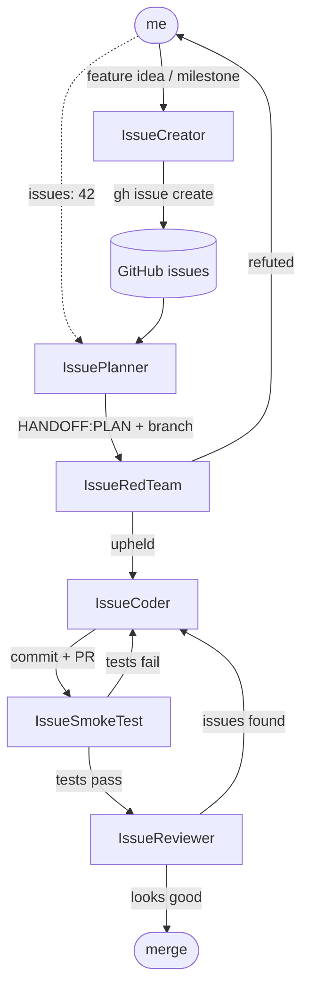
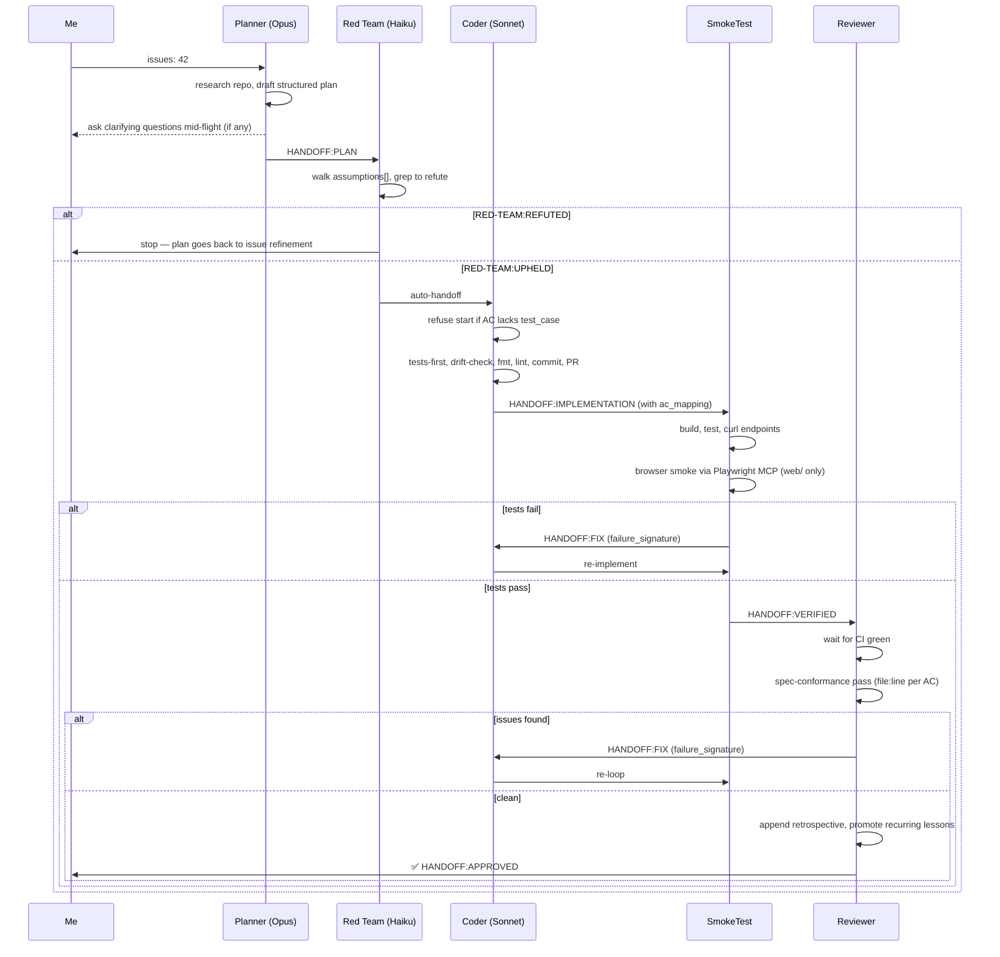

# bastion

A vibe-coded tower-defense project. The code in here was not lovingly hand-crafted — it was orchestrated through a small army of AI agents that plan, code, smoke test, and review each other in a loop. I sit at the wheel; the agents do the typing.

This README is mostly about **how I work on this repo**, not about the game.

## The agent pipeline

Five agents in a chain, plus a creator for backlog grooming:

**Planner → Red Team → Coder → SmokeTest → Reviewer**

There are three parallel sets of agent definitions — same pipeline, different homes:

- **VS Code (Copilot Chat)** reads [`.github/agents/*.agent.md`](./.github/agents/)
- **Cursor** reads [`.cursor/agents/*.md`](./.cursor/agents/) plus rules in [`.cursor/rules/*.mdc`](./.cursor/rules/)
- **Claude Code** reads [`.claude/agents/*.md`](./.claude/agents/) and the orchestrator at [`.claude/commands/pipeline.md`](./.claude/commands/pipeline.md)

Keeping them in sync is a manual chore, but the workflow they describe is identical.



The handoffs are wired in the agent frontmatter (`handoffs:` block), so once a stage finishes the next one is auto-invoked. Reviewer, Planner, and Red Team are read-only — only the Coder writes files.

### Hardening (issue #49)

Every handoff between stages is a **typed YAML block** that conforms to [`docs/pipeline-handoff-schema.md`](./docs/pipeline-handoff-schema.md). The schema is the contract; downstream agents reject malformed handoffs and bounce back, instead of trusting whatever the previous LLM emitted. Key behaviours:

- **Structured plan.** The plan is not prose — it has `acceptance_criteria[]` with stable ids, `files_touched[]`, `interfaces[]`, `test_cases[]` (one per AC), `assumptions[]`, and `non_goals[]`. The coder **refuses to start** if any AC lacks a mapped test case.
- **Red Team pass.** Between Planner and Coder, the Red Team agent walks every `assumptions[]` entry and tries to refute it by reading the repo. On `RED-TEAM:REFUTED` the plan goes back to the user, not to the coder — the worst LLM failure is a confidently wrong premise.
- **Drift guard.** The coder periodically emits `current AC / current file / why`; edits outside `files_touched[]` bounce the plan back.
- **Failure-signature circuit breaker.** Every `HANDOFF:FIX` carries `failure_signature: { stage, class, symbol }`. The orchestrator hashes it and **escalates to the user on repeat** instead of burning another retry on the same bug.
- **Token-budget ceiling.** Per-issue cap (default 400 000, override via `BASTION_PIPELINE_BUDGET`).
- **Per-run observability.** Each `/pipeline` invocation writes JSONL rows to `.pipeline-runs/<issue>/<run-id>.jsonl` — stage, model, tokens, duration, verdict, failure signature. Schema in [`docs/pipeline-observability.md`](./docs/pipeline-observability.md).
- **Enforced lessons.** When a `LEARNINGS.md` entry is promoted to `AGENTS.md`, the reviewer also creates a deterministic check (lint rule, grep hook, or test) where possible. Prose lessons rot; enforced lessons compound.

Only Claude Code's `/pipeline` orchestrator enforces the circuit breaker, token budget, and JSONL log directly — the other two homes auto-chain via `handoffs:` frontmatter and rely on each agent's prompt-level checks. The schema, structured plan, red-team pass, drift guard, and enforced-lessons rule are identical across all three homes.

## Example flow — VS Code (Copilot Chat)

This is my daily driver. Copilot Chat picks up the agents from `.github/agents/*.agent.md` automatically.

1. **Groom the backlog** — `@IssueCreator break down the lobby-matchmaking feature into issues`. It runs an ambiguity gate (lists every unclear point or writes NONE), waits for answers, then writes labels, milestones, and issues with binary acceptance criteria via `gh`. **This is the real planning gate** — the AC list is the contract everything downstream is measured against.
2. **Plan** — `@IssuePlanner issues: 42`. Reads the issue, scans `LEARNINGS.md` for past lessons that apply, greps the repo, asks clarifying questions mid-flight if anything's ambiguous, writes a structured plan (per [`docs/pipeline-handoff-schema.md`](./docs/pipeline-handoff-schema.md)) to `/memories/session/plan.md`, creates the branch, and auto-hands off to the **Red Team**. There is no terminal "approve plan" gate — if you need one, you wanted the ambiguity caught at issue-creation time.
3. **Auto-handoff to Red Team** — walks every `assumptions[]` entry from the plan and tries to refute it by reading the repo. `RED-TEAM:UPHELD` → hands off to Coder. `RED-TEAM:REFUTED` → escalates to me (the plan goes back to issue refinement).
4. **Auto-handoff to Coder** — refuses to start if any AC lacks a mapped `test_case`. Otherwise implements the plan (tests-first for any pure-domain code under `internal/<subsystem>/`), runs periodic drift-checks against `files_touched[]`, runs `make fmt` / `make lint` / `bun run lint`, commits, opens a PR. The PR description cites a `file:line` per AC.
5. **Auto-handoff to SmokeTest** — builds, runs unit tests, boots the server, curls the new endpoints. For any change under `web/`, also drives a real browser via the [Playwright MCP](https://github.com/microsoft/playwright-mcp) server (registered in `.mcp.json`, `.cursor/mcp.json`, `.vscode/mcp.json`) to navigate, snapshot, screenshot canvas pages, and check console errors. **Browser smoke is local-only** — CI does curl + unit; the MCP layer is what the local pipeline catches on top. Failures carry a `failure_signature` that the orchestrator hashes to detect retry loops.
6. **Auto-handoff to Reviewer** — waits for CI green, does an explicit spec-conformance pass (cites a `file:line` for every acceptance-criterion checkbox or marks it UNMET), runs the review checklist, appends a one-line **Retrospective** to `LEARNINGS.md`, and promotes recurring lessons to `AGENTS.md` along with a deterministic enforcement artifact (lint rule, grep hook, or test). Bounces back to Coder on findings; otherwise I merge.

Models used (set per-agent in the frontmatter):
- Planner: **Claude Opus 4.7**
- Red Team: **Claude Haiku 4.5** (cheap by design — its job is to grep, not to think)
- Coder / SmokeTest / Reviewer: **Claude Sonnet 4.6**

## Example flow — Cursor

Cursor has its own agent system under [`.cursor/agents/`](./.cursor/agents/) (`planner.md`, `red-team.md`, `coder.md`, `smoke-tester.md`, `reviewer.md`, `issue-creator.md`) with shared conventions in `_bastion-conventions.md` and rules in `.cursor/rules/subagents.mdc`. The pipeline mirrors the VS Code one one-for-one:

```
@planner issues: 42   →   @red-team   →   @coder   →   @smoke-tester   →   @reviewer
```

No terminal plan-approval gate — clarifications happen mid-flight via `askQuestions`, and the real planning happens upstream in `@issue-creator`.

**A note on models:** you should be running better models than I did here — ideally **Opus 4.7** (or whatever the current top-tier reasoner is) on the planner, and Sonnet 4.6 on the rest. Planning is where bad calls compound, so spend the tokens there. I set this repo up while stuck in the Cursor slow pool, so the actual outputs reflect that, not what the pipeline can do when properly fed.

## Example flow — Claude Code

Claude Code has the same six agents under [`.claude/agents/`](./.claude/agents/) (`planner.md`, `red-team.md`, `coder.md`, `smoke-tester.md`, `reviewer.md`, `issue-creator.md`) sharing `_bastion-conventions.md`. The key structural difference: **Claude Code has no auto-handoff button.** Subagents return one summary and stop.

To bridge that, there's a slash command at [`.claude/commands/pipeline.md`](./.claude/commands/pipeline.md). You run it as:

```
/pipeline 42
```

The orchestrator invokes each agent in sequence via the `Agent` tool, parses the typed `HANDOFF:*` block against [`docs/pipeline-handoff-schema.md`](./docs/pipeline-handoff-schema.md), and routes based on the verdict. It additionally:

- **rejects malformed handoffs** without invoking the next LLM stage,
- **hashes failure signatures** and breaks the loop on repeat,
- **enforces a per-issue token budget** (default 400 000, override via `BASTION_PIPELINE_BUDGET`),
- **writes one JSONL row per stage** to `.pipeline-runs/<issue>/<run-id>.jsonl`.

Per-stage retries are still capped at 3 as a backstop, but the signature check fires first. Pipeline behaviours (ambiguity gate, tests-first, drift guard, spec-conformance pass, CI-green gate, `LEARNINGS.md` write/read, enforced lessons) are identical to the other two homes — only the chaining and the orchestrator-level enforcement differ.

## The inner loop (what each cycle looks like)



## Repo layout (the short version)

- `cmd/api`, `cmd/migrate` — Go entry points
- `internal/<subsystem>/` — pure domain logic, no `net/http`
- `internal/http/*_endpoint.go` — HTTP layer (minmux)
- `migrations/` — golang-migrate SQL
- `web/` — Bun + React + Vite + Tailwind 4 SPA
- `.github/agents/`, `.cursor/agents/`, `.claude/agents/` — the three agent homes that actually wrote most of this
- [`LEARNINGS.md`](./LEARNINGS.md) — one-line-per-PR retrospective log the Reviewer **writes to directly** (via `Add-Content` from the terminal) on clean verdicts. The Planner **reads** it before drafting each new plan, so applicable past lessons surface in the new plan's summary. Lessons that appear twice get promoted to `AGENTS.md` and, where possible, backed by a deterministic enforcement artifact (lint rule, grep hook, or test) so the lesson can't quietly rot.
- [`docs/pipeline-handoff-schema.md`](./docs/pipeline-handoff-schema.md) — canonical contract for every `HANDOFF:*` block. The orchestrator and downstream agents validate against this schema.
- [`docs/pipeline-observability.md`](./docs/pipeline-observability.md) — `run.jsonl` schema and recipes for slicing the per-run logs under `.pipeline-runs/`.

Architecture rules and the dev workflow agents must follow live in [AGENTS.md](AGENTS.md) and [docs/backend-architecture.md](docs/backend-architecture.md).

## Running it

```bash
git clone https://github.com/JoakimCarlsson/bastion.git
cd bastion
git submodule update --init --recursive
cp .env.example .env
docker compose up --build
```

API on `:8080`, SPA dev server via `cd web && bun run dev` on `:5173`. `make help` lists every other target.

## License

MIT — see [LICENSE](LICENSE).
